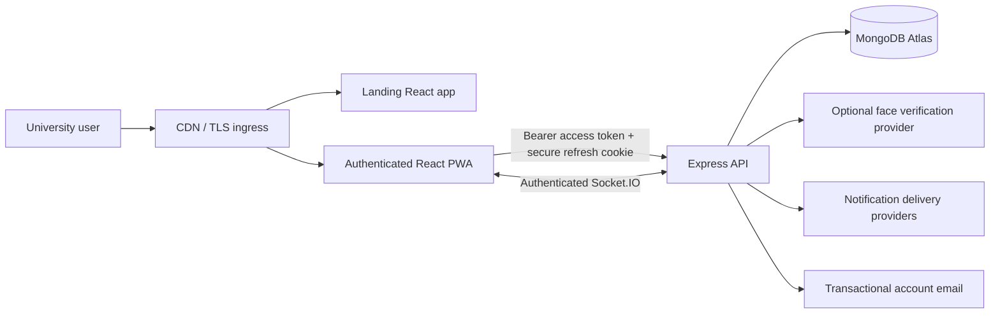
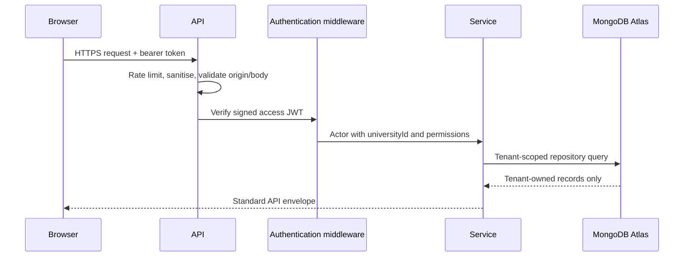
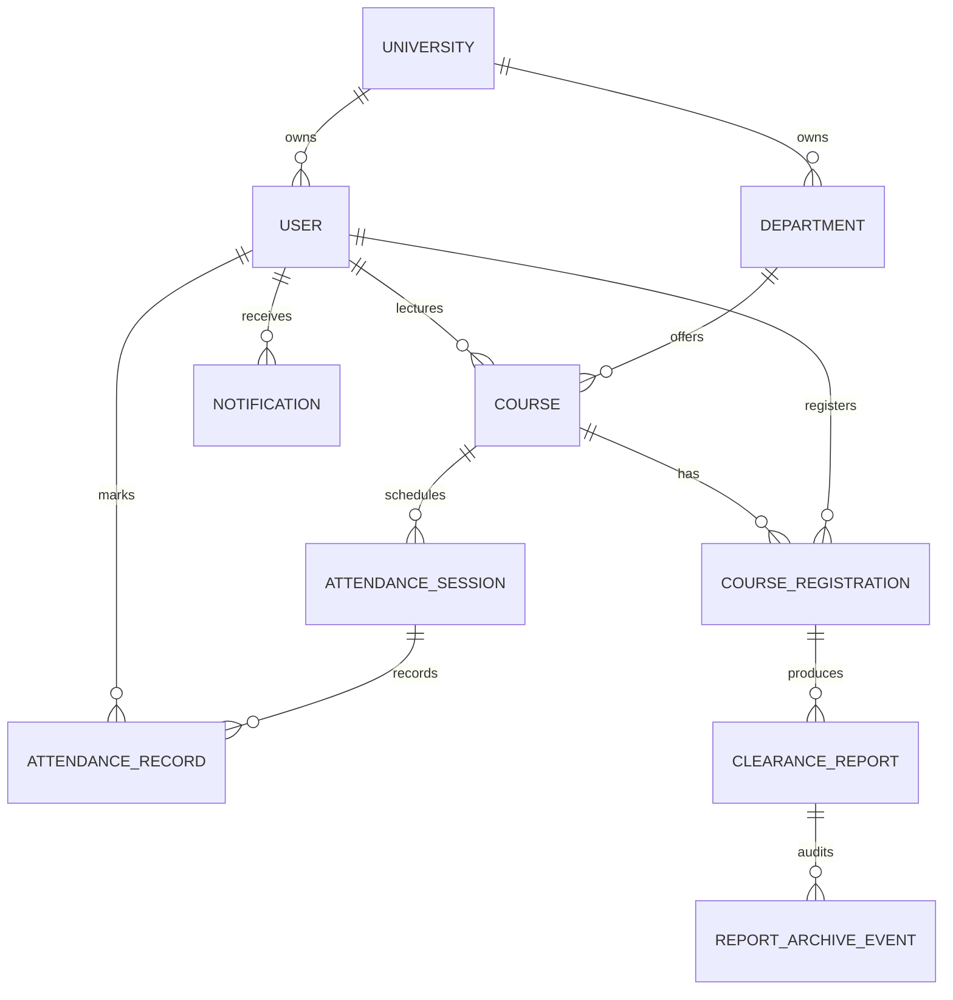
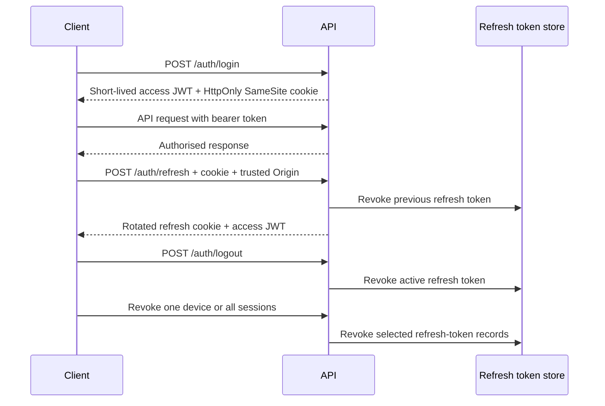
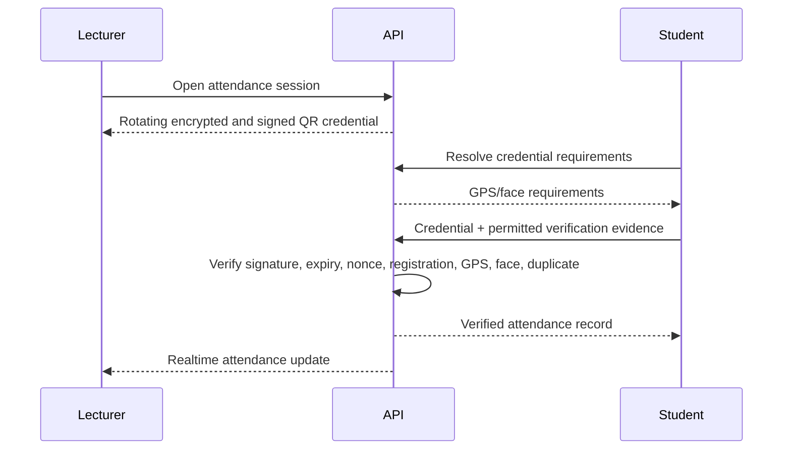
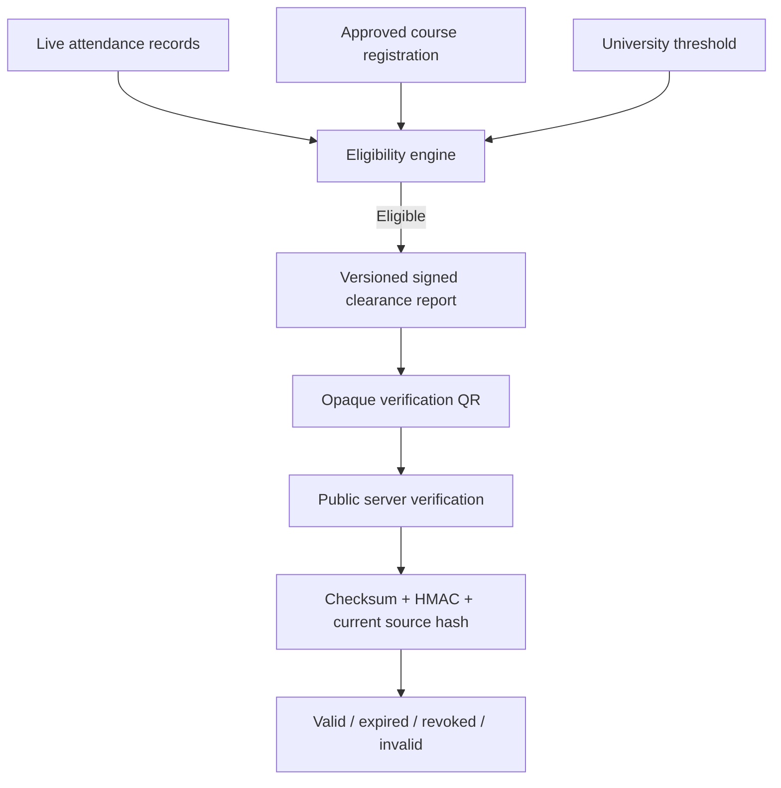

# Attendity architecture

Attendity is a TypeScript npm-workspaces monorepo. The public site and authenticated product are independently deployable React applications. The Express API owns business rules, tenant isolation, authentication, exports, audit events, notifications, and realtime delivery. MongoDB Atlas is the only supported production database.

## Request and tenancy boundary

Every tenant-owned schema includes `universityId`, timestamps, audit actor fields, and soft-deletion support. Controllers translate HTTP concerns; services enforce business rules; repositories own database access; Zod schemas validate external input.

## Core data model

## Authentication flow

## Attendance and QR flow

## Eligibility and clearance flow

Clearance decisions are never trusted from QR payloads or cached client state. Verification always occurs on the server against the signed report and current attendance source.
